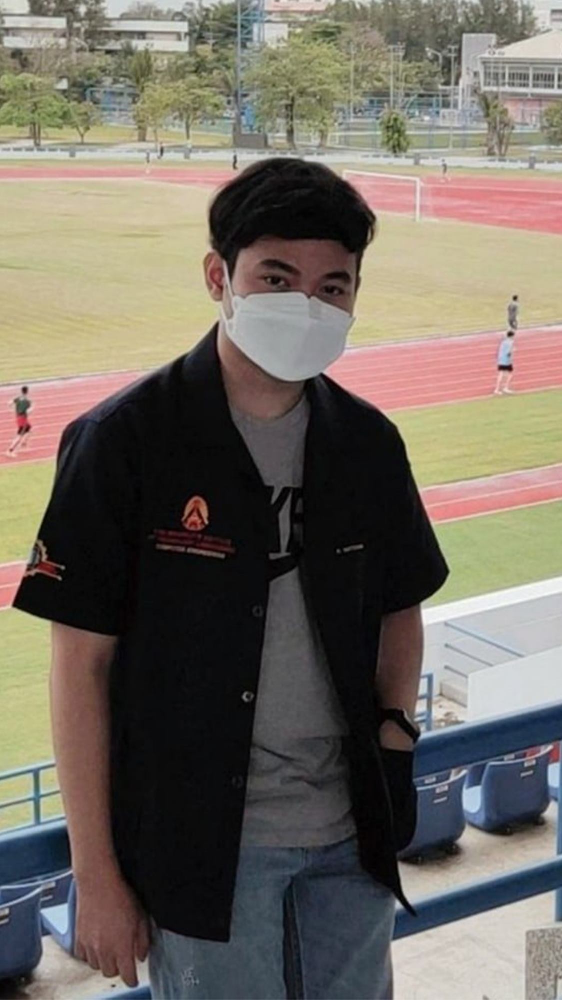
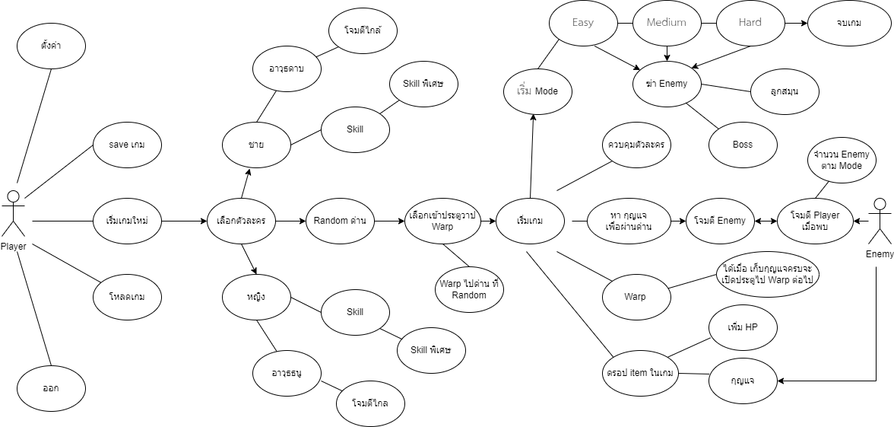

# 04-3D_RPG_Game_Development

## 📖 รายละเอียดกลุ่ม
โครงงานนี้เป็นการพัฒนา 3D RPG Game โดยใช้โปรแกรม Unity และ ภาษา C#
ชื่อภาษาไทย : การพัฒนาเกมส์ 3D RPG
ชื่อภาษาอังกฤษ : 3D_RPG_Game_Development
อาจาร์ยที่ปรึกษา :  ผศ. ดร. ธนัญชัย ตรีภาค
ชื่อกลุ่ม : อาเนียชอบกินถั่ว

## ⚔ Game Development
| 
SW_Dev | 
SW_Dev |
| :-------------:  | :-------------: |
| 
 | 
 |
| 
ID : 63015049 | 
ID : 63015098 |
| 
Nattaphon Suksomroop | 
Nanthikan Praesirirak |
---

## Wellcome to Project

  
## Use case

## Table
---
| Number | System | Technical | Testing | ✅ / X |
| ----------- | ----------- | ----------| ----------| ----------|
| 1 | การเดินหน้า-หลัง ซ้าย ขวา กระโดดและมุมกล้อง | 5 | 5 | ✅ |
| 2 | การโจมตีระยะไกล้ - ระยะไกล | 5 | 5 | ✅ |
| 2 | การโจมตีระยะไกล้ - ระยะไกล | 5 | 5 | ✅ |
| 2 | การโจมตีระยะไกล้ - ระยะไกล | 5 | 5 | ✅ |
| 2 | การโจมตีระยะไกล้ - ระยะไกล | 5 | 5 | ✅ |
| 2 | การโจมตีระยะไกล้ - ระยะไกล | 5 | 5 | ✅ |
| 2 | การโจมตีระยะไกล้ - ระยะไกล | 5 | 5 | ✅ |
| 2 | การโจมตีระยะไกล้ - ระยะไกล | 5 | 5 | ✅ |
| 2 | การโจมตีระยะไกล้ - ระยะไกล | 5 | 5 | ✅ |
| 2 | การโจมตีระยะไกล้ - ระยะไกล | 5 | 5 | ✅ |
| 2 | การโจมตีระยะไกล้ - ระยะไกล | 5 | 5 | ✅ |
| 2 | การโจมตีระยะไกล้ - ระยะไกล | 5 | 5 | ✅ |
| 2 | การโจมตีระยะไกล้ - ระยะไกล | 5 | 5 | ✅ |
| 2 | การโจมตีระยะไกล้ - ระยะไกล | 5 | 5 | ✅ |
---

